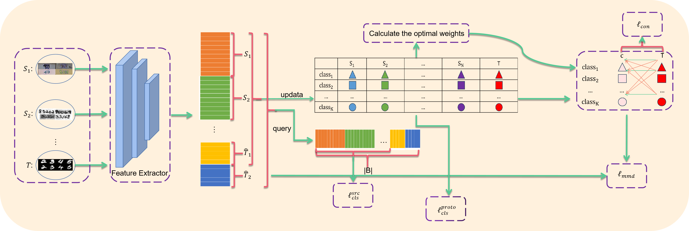

# PC-MSUDA
A PyTorch implementation of 'Combined Prototype for Multi-source Unsupervised
Domain Adaptation'.



The contributions of this paper are summarized as follows. 

*  Toward the MSUDA problem, we propose a contrastive combined prototype method,named PC-MSUDA. Such a method can measure the transferable abilities of each source by calculating combined prototypes. The combined prototypes can help reflect the features of each class in source domains.
+ We design a simple yet efficient method to compute the optimal weights of the source domain prototypes and provide a rigorous theoretical proof.
+ In PC-MSUDA, we propose a coarse-grained alignment strategy to alleviate the issue of low-confidence information loss. Such a strategy estimate low-confidence target samples with maximum mean discrepancy.

+ Extensive experiments on three widely used benchmark datasets obtain interpretable results, which demonstrate superior and effective performance compared to the existing approaches.

## Requirement
* python 3.8
* pytorch 1.11.0+cu113
* torchvision 0.12.0+cu113

### Dataset Preparation

* [Digits-five](https://drive.google.com/open?id=1A4RJOFj4BJkmliiEL7g9WzNIDUHLxfmm)
* [PACS](https://github.com/MachineLearning2020/Homework3-PACS/tree/master/PACS)
* [office\_ caltech\_10](https://gitcode.net/mirrors/jindongwang/transferlearning/-/blob/master/data/dataset.md#office+caltech)

### Pre-trained Models

+ [ResNet-18](https://download.pytorch.org/models/resnet18-5c106cde.pth)
+ [ResNet-101](https://download.pytorch.org/models/resnet101-5d3b4d8f.pth)

### Run the code

To train the baseline model without target data, simply run:
```
python train.py --use_target --save_model --target $target_domain$ --checkpoint_dir $checkpoint$ \
			   --max_epoch 30 --save_epoch 1 --batch_size 128 \
			   --record_folder $path_record$
```

To train the full model of PC-MSUDA, simply run:
```
python train.py --use_target --save_model --target $target_domain$ --checkpoint_dir $checkpoint$ \
			   --max_epoch 30 --save_epoch 1 --batch_size 128 \
			   --record_folder $path_record$
```

To evaluate the PC-MSUDA model, you can run:

```
python test.py --target $target_domain$ --load_checkpoint $checkpoint_file$
```


### Acknowledgements

Some codes are adapted from [Ltc-MSUDA](https://github.com/ChrisAllenMing/LtC-MSDA.). We thank them for their excellent projects.
### Contact
If you have any problem about our code, feel free to contact zifengxie25@gmail.com or describe your problem in Issues.
